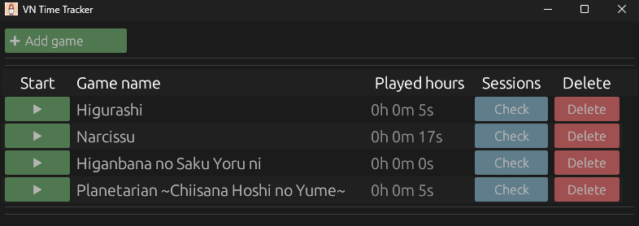

# VN Time Tracker

### Minimalistic time tracker for Windows applications

VN Time Tracker helps you measure how much time you spend in different apps and games.

## Features
- Add any `.exe` via the **Add game** button
- Rename entries with a double click (in case the `.exe` name is not user-friendly)
- Launch apps with the **Start** button
- Time is automatically tracked after the app is closed
- Add the same `.exe` multiple times to track different activities separately  

## Planned
- Drag & drop to reorder apps in the list
- Categories: create, move apps into categories, collapse/expand categories
